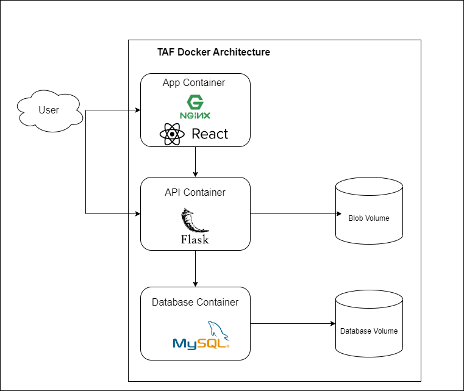

# TAF2.0
A new and improved web application for music and artist management.

## Tech Stack
- Frontend: ReactJS + TypeScript
- Backend: Python Flask
- Database: MySQL
- Distribution: Docker

## Requirements
To develop and run this application you'll need to install the following:
 - [docker](https://docs.docker.com/get-docker/)
 - [docker-compose](https://docs.docker.com/compose/install/)
 - [NodeJS](https://nodejs.org/en/download/)
 - [python3](https://www.python.org/downloads/)

It is also recommended that you use an IDE such as VS Code.

## Getting Started
This application has 3 primary components
- Frontend (ReactJS)
- Backend (Python/Flask)
- Database (MySQL)

Each of these components has a .env file that includes necessary environment variables.
- `.frontend.env`
- `.backend.env`
- `.database.env`

To automatically generate these environment files, run the `./install.sh` script found in the root directory of this repo.

_Note: For local environments, use the following API URL: `http://localhost:8080`_

**These environment files help with deployment from local to production environments. They should not contain any production values, keys, or authentication tokens.**

### Running the full stack in Docker
`docker-compose` can be used to launch the entire stack within a dockerized environment. When working with Docker, you need to `build` and `run` your docker images. All docker configurations are within the repo root directory. From that directory, you can run `docker-compose` commands to manage the application.

To Build:
```bash
docker-compose build
```

To Run:
```bash
docker-compose up -d
```

To Stop:
```bash
docker-compose down
```

"Building" the application creates Docker images based on the Dockerfile configurations. Whenever you make changes to the application source code, you'll want to rebuild the Docker images.


### Running the backend manually

If you intend to run the backend outside of Docker, it is strongly encouraged that you use a python virtual environment.

Create a reusable virtual environment.
```
python3 -m venv ~/virtual_envs/tafapi
```
Initialize the environment.
```
source ~/virtual_envs/tafapi/bin/activate
```
Install requirements for runtime. This is not necessary if you have already installed these dependencies and no dependency changes have occurred.
```
python3 -m pip install -r backend/requirements.txt
```

Now you are ready to run the backend application. However, you need to set necessary environment variables.
The quickest way to do this is by running the following command to export both the backend and database environment variables.
```
export $(xargs < backend/.backend.env)
export $(xargs < database/.database.env)
```

Finally, navigate to the `backend/` directory and run the command `python3 wsgi.py`.

If successful, the API should be available at `http://localhost:5000/`.

### Running the frontend manually
To run the Frontend application, first navigate to the `frontend/` directory. You should first ensure that you have all required NPM modules installed. To do so, run the command `npm install`.

After all NPM modules are installed, you can launch the Frontend application with the command `npm run start`. Additional NPM commands are available and can be found within the "scripts" section of the `package.json` file for the Frontend app.

If successful, the web page should be available at `http://localhost:3000/`.

Note:
 - If the backend is not running, the frontend will not be fully functional
 - You only need to run `npm install` the first time you run the app and after modifying NPM modules. You do not need to reinstall NPM modules after making code changes.

## Tech Stack
The TAF2.0 tech stack uses dockerized components for the web app, the web api, and the database. Persistent data is stored in Docker volumes. The following illustration outlines the current tech stack.
